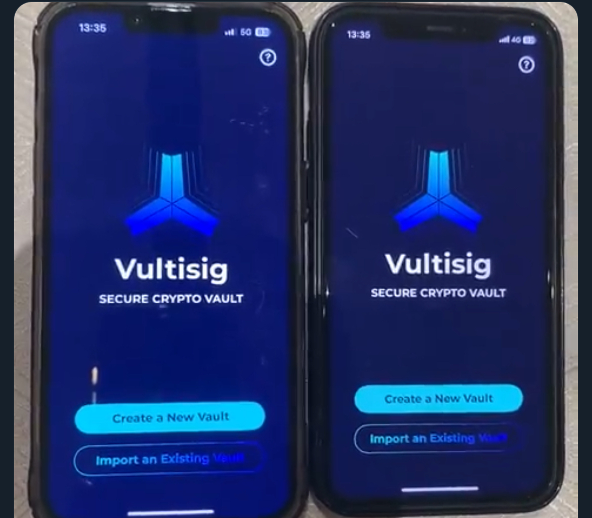

# Vault Reshare

<figure><figcaption>
Feature in settings
</figcaption></figure>

## What is the Reshare feature

Resharing is a feature that can be used in two ways.

1. Allows the user to reshare the current Vault configuration and update the vault shares of the current present devices of a Vault.
2.  To increase/decrease the number of participating devices in a Vault setup.

<figure><figcaption></figcaption></figure>

## How to use the Feature


A threshold majority is **always** required to use this feature. \
For example, for a 2-of-2 vault, both devices must be present.


Do this if a device has been lost in a 2-of-3 setup and you need to add a new, unique device or update the current shares.\
_If a device of a 2-of-2 setup is lost please use the_ [_backup feature_](vault-backup.md)_._

_Click on the above Image to watch a explanation Video on Twitter_

After clicking "Reshare" in the Vultisig Vault menu, the next steps are very similar to creating a Vault, as the reshare feature is just another keygen ceremony.

<figure><figcaption></figcaption></figure>

## When to use the Reshare feature

Like described in the section about [what the feature is](vault-reshare.md#what-is-the-reshare-feature), it can be used for the following:

### Resharing the current Vault Setup

This option doesn't change the configuration, it just refreshes the Vault shares. \
This feature is recommended if there is a possibility that a Vault share has been compromised.

### Changing the Number of Parties

Changing the number of parties is as simple as joining another keygen session. \
This gives the ability to change the number of devices participating in a setup. \
New unique devices can be added or old devices can be excluded.

## **IMPORTANT NOTE FOR RESHARE**

After resharing a vault, the vault shares of each device also change.\
This invalidates the old backups of the shares in Vultisig and increases the risk that mixed backups will be imported and restored. \
**This can result in inaccessible vaults.**\
_If that happened the_ [_emergency recovery_](../../threshold-signature-scheme/emergency-recovery.md) _can be used as last resort._

Any device that was not present in a reshare will have a different vault share to the rest of the vault, making it impossible to join the keygen or keysign after the reshare. \
This is intentional, as vault shares can be disabled in Vultisig if a share is suspected of being compromised.


**Be sure to ALWAYS back up your Vault shares after using the reshare feature!**

